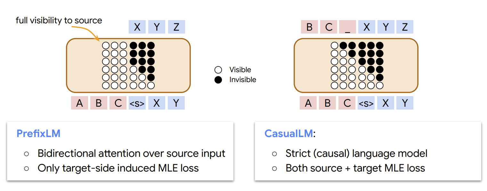

# triton-prefix-lm-flash-attn
FlashAttention for prefix language modeling written in Triton. This kernel is implemented identically to causal FlashAttention but applies bidirectional attention in the prefix region of the sequence as illustrated below.

image source: [PrefixLM4MT (ICML 2022), Biao Zhang et al.](https://icml.cc/media/icml-2022/Slides/17048.pdf)

Only been tested on sequence lengths and prefix lengths that are divisible by 64. Prefix and full sequence length is assumed to be constant in the batch.

Requires:
 - trition-nightly

Hardware tested:
 - H100
 - A100
 - A10
